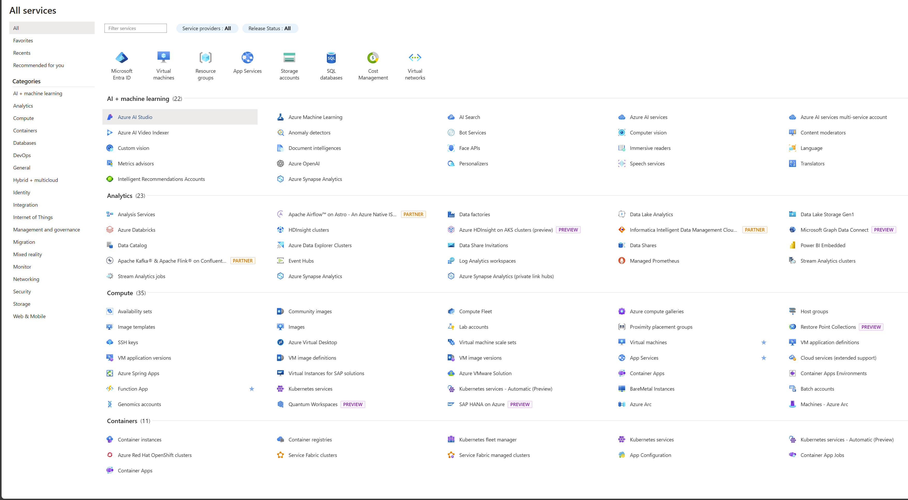

# Microsoft-Azure---Localizando-Servicos-por-Categoria
Este projeto você verá na prática a aplicação dos conceitos de computação em nuvem.

# Principais Serviços do Microsoft Azure

Este documento lista os principais serviços do **Microsoft Azure**, organizados por categorias. Para cada serviço, incluímos uma breve descrição, links relacionados e sugestões de imagens para melhor ilustrá-los.

## 1. Computação

### 1.1. **[Máquinas Virtuais (Azure Virtual Machines)](https://azure.microsoft.com/services/virtual-machines/)**
Serviço que permite criar e gerenciar VMs no Azure, escaláveis e seguras.

---

### 1.2. **[Azure Kubernetes Service (AKS)](https://azure.microsoft.com/services/kubernetes-service/)**
Serviço gerenciado de Kubernetes que facilita a implantação, gerenciamento e operação de clusters Kubernetes.

---

### 1.3. **[Azure Functions](https://azure.microsoft.com/services/functions/)**
Permite executar código sem provisionar servidores, ideal para pequenas tarefas que podem ser acionadas por eventos.

---

## 2. Rede

### 2.1. **[Azure Virtual Network (VNet)](https://azure.microsoft.com/services/virtual-network/)**
Criação de redes privadas seguras para conectar suas VMs e outros recursos.

---

### 2.2. **[Azure VPN Gateway](https://azure.microsoft.com/services/vpn-gateway/)**
Criação de uma conexão VPN entre sua rede local e a rede virtual do Azure.

---

### 2.3. **[Azure Traffic Manager](https://azure.microsoft.com/services/traffic-manager/)**
Gerenciamento de tráfego de rede para distribuir solicitações de usuários de forma otimizada.

---

## 3. Armazenamento

### 3.1. **[Azure Blob Storage](https://azure.microsoft.com/services/storage/blobs/)**
Serviço de armazenamento de objetos otimizado para grandes volumes de dados não estruturados, como imagens e vídeos.

---

### 3.2. **[Azure Files](https://azure.microsoft.com/services/storage/files/)**
Armazenamento de arquivos totalmente gerenciado, acessível por SMB.

---

### 3.3. **[Azure Disk Storage](https://azure.microsoft.com/services/storage/disks/)**
Armazenamento em disco de alta performance para máquinas virtuais.

---

## 4. Banco de Dados

### 4.1. **[Azure SQL Database](https://azure.microsoft.com/services/sql-database/)**
Banco de dados relacional totalmente gerenciado e baseado no Microsoft SQL Server.

---

### 4.2. **[Azure Cosmos DB](https://azure.microsoft.com/services/cosmos-db/)**
Banco de dados NoSQL globalmente distribuído e altamente escalável.

---

### 4.3. **[Azure Database for MySQL/PostgreSQL](https://azure.microsoft.com/services/mysql/)**
Banco de dados relacional gerenciado, com suporte para MySQL e PostgreSQL.

---

## 5. IA e Machine Learning

### 5.1. **[Azure Cognitive Services](https://azure.microsoft.com/services/cognitive-services/)**
Conjunto de APIs para adicionar recursos de visão computacional, reconhecimento de fala, análise de texto e mais.

---

### 5.2. **[Azure Machine Learning](https://azure.microsoft.com/services/machine-learning/)**
Serviço para criação, treinamento e implantação de modelos de machine learning.

---

### 5.3. **[Azure Bot Service](https://azure.microsoft.com/services/bot-services/)**
Plataforma para criação e gerenciamento de chatbots inteligentes.

---

## 6. DevOps

### 6.1. **[Azure DevOps](https://azure.microsoft.com/services/devops/)**
Conjunto de ferramentas para desenvolvimento, versionamento de código, integração contínua e entrega contínua (CI/CD).

---

### 6.2. **[Azure Pipelines](https://azure.microsoft.com/services/devops/pipelines/)**
Serviço para configurar e gerenciar pipelines de CI/CD.

---

### 6.3. **[Azure Repos](https://azure.microsoft.com/services/devops/repos/)**
Repositórios Git gerenciados no Azure, com ferramentas de versionamento e colaboração.

---

## 7. Identidade e Segurança

### 7.1. **[Azure Active Directory (Azure AD)](https://azure.microsoft.com/services/active-directory/)**
Serviço de gerenciamento de identidades e acessos, que oferece autenticação única (SSO) e gerenciamento de usuários.

**Imagem sugerida:** Um diagrama de gerenciamento de identidade com ícones de autenticação multifatorial (MFA).

---

### 7.2. **[Azure Security Center](https://azure.microsoft.com/services/defender-for-cloud/)**
Central de gerenciamento de segurança para monitoramento e proteção de ambientes híbridos e na nuvem.

**Imagem sugerida:** Um painel de segurança mostrando alertas e recomendações.

---

### 7.3. **[Azure Key Vault](https://azure.microsoft.com/services/key-vault/)**
Armazenamento centralizado para segredos, como chaves de criptografia, certificados e senhas.

**Imagem sugerida:** Um cofre digital com chaves de criptografia ao redor.

---

## 8. Analytics

### 8.1. **[Azure Synapse Analytics](https://azure.microsoft.com/services/synapse-analytics/)**
Serviço unificado para análise de big data e armazenamento de dados.

---

### 8.2. **[Azure Data Lake](https://azure.microsoft.com/services/storage/data-lake-storage/)**
Armazenamento de dados em larga escala, otimizado para análise de grandes volumes de informações.

